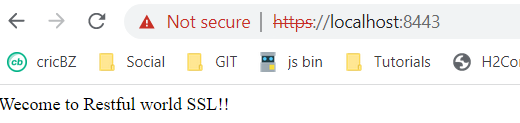
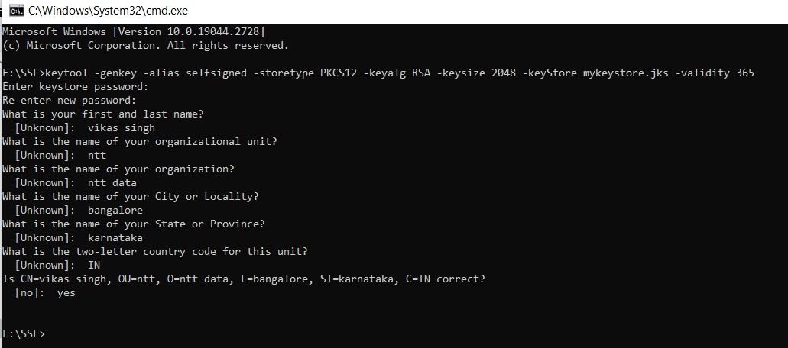

### Spring Boot SSL WelApp
### when enter local host 8080(http) redirect to 8443(https)

### Enter http:8080

### redirect To https:8443

### Key Generatation based on properties file

### E:\SSL>keytool -genkey -alias selfsigned -storetype PKCS12 -keyalg RSA -keysize 2048 -keyStore mykeystore.jks -validity 365
